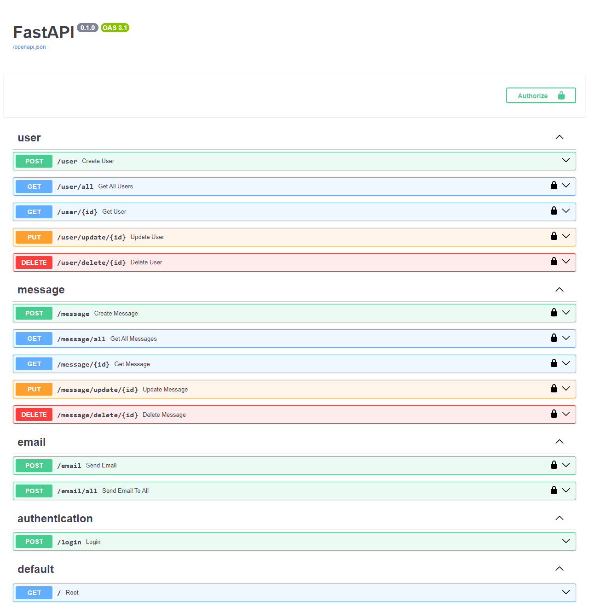

# Envelope API

This project has been implemented using FastAPI for managing messages and users. It allows for CRUD (Create, Read, Update, Delete) operations on messages and user accounts, with role-based authorization.

## Features

* User Management:
    * User registration and login.
    * Role-based access control (RBAC) with Admin and User roles.
* Message Management:
    * Admin users can create and assign messages to specific users.
    * Users can view their assigned messages.
